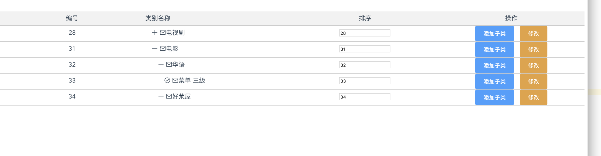

# vue-folder-demo 基于elementUI的el-row实现文件夹树的demo



## 实现原理:

```html

设计思路:创建一个一维数组指针指向->多维数数据元素. 为了方便用一维数组循环
 注意那个id的规则哦,从上往下,从外往内逐步递增.这很重要,不然会乱套
 
 

树形效果原理:用padding-left样式缩进调整.


function createLinearArray (data, level = 1) {
        data.forEach(v => {
          v.level = level
          if (v.level === 1) {
            v.expand = true
          } else {
            v.expand = false
          }
          linearArray.push(v)
          if (v.children) {
            createLinearArray(v.children, level + 1)
          }
        })
      }
这里的level是为了指定是多少组菜单,这样,就可以缩进效果进行调整,level越大,缩进越大.
这里的expand为了控制显示和展示,初始化时,第一级是展示的,二级以上,都是隐藏的.


linearArray.sort((a, b) => {
        return a.id - b.id
      })
      
      注意排序,这是为了方便按顺序的展示,这是为了按顺序展示数据
      
      
     
```

## 安装

``` bash
# install dependencies
npm install

# serve with hot reload at localhost:8080
npm run dev

# build for production with minification
npm run build

# build for production and view the bundle analyzer report
npm run build --report

# run unit tests
npm run unit

# run e2e tests
npm run e2e

# run all tests
npm test
```

